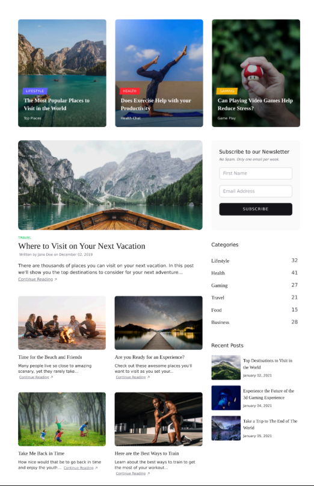
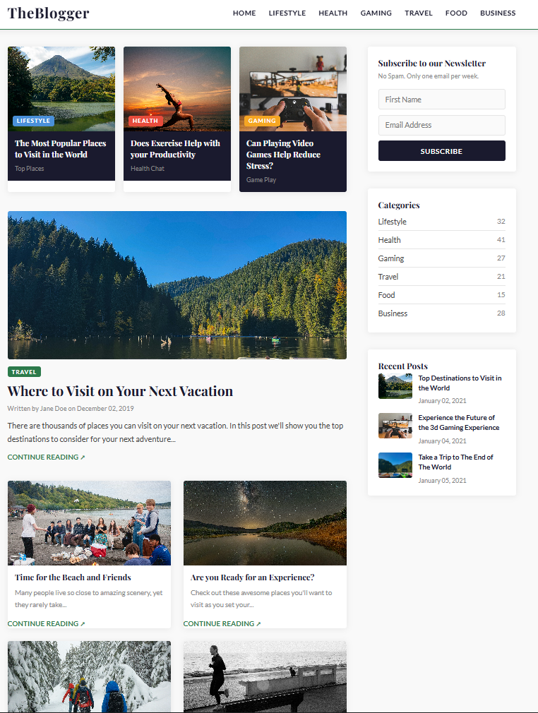

# Tarea 1 — Clon de Sección de Sitio Real

**Estudiante:** Emiliano Martinez
**Curso:** Desarrollo Web — HTML & CSS (MULTIMEDIOS)
**Sitio clonado:** TheBlogger (blog de contenido estilo revista)
**Repositorio:** `https://github.com/LeBron01603/tarea1-clon-web.git`

---

## Comparación: Original vs Clon

### Original


### Mi Clon


---

## 🗂️ Estructura de Archivos

```
tarea1-clon-web/
├── index.html       # Estructura HTML semántica completa
├── styles.css       # Todos los estilos en archivo externo
├── README.md        # Este archivo
└── img/
    ├── travel.jpg
    ├── health.jpg
    ├── gaming.jpg
    ├── vacation.jpg
    ├── beach.jpg
    ├── stars.jpg
    ├── kids.jpg
    ├── training.jpg
    ├── screenshot-original.png
    └── screenshot-clon.png
```

---

## ✅ Requisitos Cumplidos

### HTML Semántico
- ✅ Estructura completa: `<!DOCTYPE html>`, `<head>`, `<body>`
- ✅ Etiquetas semánticas: `<header>`, `<nav>`, `<main>`, `<section>`, `<article>`, `<aside>`, `<footer>`, `<time>`
- ✅ Todas las imágenes con atributo `alt` descriptivo

### CSS Externo
- ✅ Todo el CSS en `styles.css` — cero `style=""` inline en el HTML
- ✅ Variables CSS en `:root`: `--color-primario`, `--color-secundario`, `--color-acento`, `--color-fondo`, etc.
- ✅ Google Fonts: **Playfair Display** (títulos) + **Lato** (cuerpo)

### Selectores (4 tipos distintos)
| Tipo | Ejemplo |
|---|---|
| Elemento | `p { }`, `a { }`, `img { }` |
| Clase | `.card { }`, `.btn-subscribe { }`, `.featured-post { }` |
| Pseudo-selector | `.card:hover`, `.form-input:focus`, `.main-nav a:hover` |
| Descendente | `.main-nav a`, `.card-img-wrap .tag` |

### Comentario de Especificidad
Ver sección `DECISIÓN DE ESPECIFICIDAD` en `styles.css` (línea ~84).
Se usó la clase `.main-layout` (especificidad 0,1,0) en lugar del selector de elemento `main` (0,0,1) para poder sobreescribirlo fácilmente en el futuro sin necesidad de usar `!important`.

### Formulario
- ✅ Campo: First Name (`type="text"`)
- ✅ Campo: Email Address (`type="email"`)
- ✅ Botón: SUBSCRIBE (`type="submit"`)

---

## Decisiones de Diseño

- **Tipografía:** Playfair Display para títulos por su estilo editorial, Lato para el cuerpo por su legibilidad en pantalla.
- **Variables CSS:** Todos los colores centralizados en `:root` para facilitar cambios globales desde un solo lugar.
- **Layout:** CSS Grid en `.main-layout` para el layout de dos columnas (contenido + sidebar), y en `.featured-cards` y `.post-grid` para las cuadrículas de artículos.
- **Accesibilidad:** Labels con clase `.sr-only` en el formulario para que los lectores de pantalla los detecten sin mostrarlos visualmente.
- **Interactividad:** Transiciones CSS en hover states de tarjetas, links y botones para una experiencia fluida sin JavaScript.

---

1. Clonar el repositorio:
```bash
git clone https://github.com/LeBron01603/tarea1-clon-web.git
```
2. Abrir `index.html` directamente en el navegador, o usar la extensión **Live Server** en VSCode (clic derecho → *Open with Live Server*).

---

## 📦 Historial de Commits

1. `feat: estructura HTML semántica inicial`
2. `feat: estilos CSS externos con variables, grid y hover states`
3. `docs: README con comparación, decisiones de diseño y estructura`